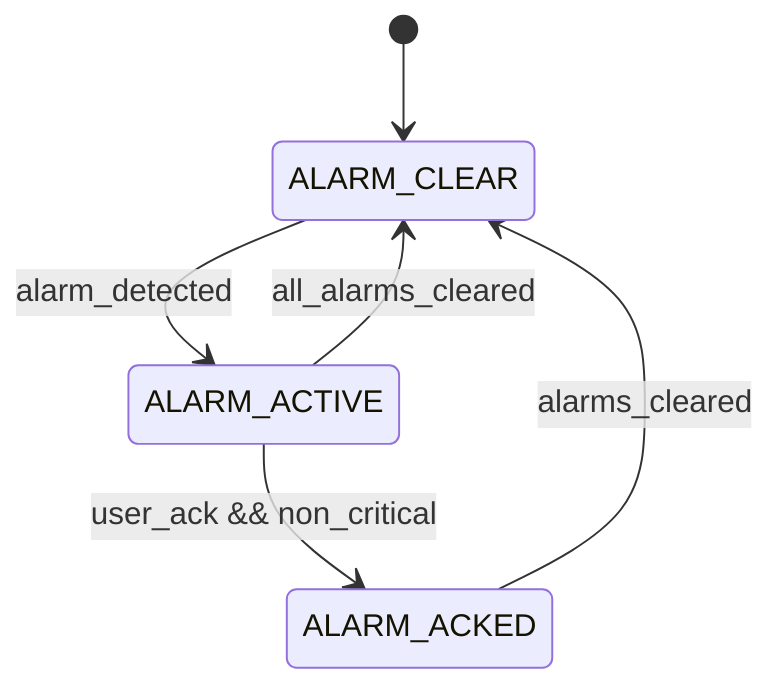

# Alarm FSM

!!! warning "Design archive — superseded by the as-built firmware"
    This page was written during the design phase, before implementation. The
    shipped firmware (v2.0.0, `egg_incubator_v2/`) implements control as
    procedural task loops rather than these formal FSM modules, and has no
    water-level hardware. Kept unchanged for design history — see
    *Software → RTOS Architecture* for the as-built design.


Purpose
- Centralize alarm detection, escalation, and user acknowledgement.

States
- `ALARM_CLEAR` — no active alarms.
- `ALARM_ACTIVE` — one or more alarms present and awaiting response.
- `ALARM_ACKED` — user acknowledged alarms; continue safe mode if needed.

Transition table

| Condition | Next State | Notes |
|---|---|---|
| no_alarms | `ALARM_CLEAR` | Normal operation |
| alarm_detected | `ALARM_ACTIVE` | Record alarm, notify supervisor |
| user_ack && non_critical | `ALARM_ACKED` | Allow auto-recovery for soft faults |
| critical_alarm | `ALARM_ACTIVE` | Requires supervisor to enforce safe shutdown |

Responsibilities
- Aggregate alarms from subsystem FSMs and hardware health checks.
- Provide an API to query active alarms and their severity.
- Expose `alarm_ack()` for user acknowledgement and record who/when.
- Inform System Supervisor to transition to `SYS_FAULT` when critical.

Implementation suggestions
- Represent alarms as typed objects with severity, source, timestamp, and
  optional recovery instructions.
- Persist critical alarm history to NVS for post-reboot diagnostics.

Testing
- Inject simulated faults (sensor invalid, over-temperature) and verify
  aggregation, escalation, and persistent logging.

State diagram



Implementation snippet

```c
typedef enum { ALARM_CLEAR, ALARM_ACTIVE, ALARM_ACKED } alarm_state_t;
static alarm_state_t alarm_state = ALARM_CLEAR;

void alarm_raise(alarm_t a) {
  record_alarm(a);
  alarm_state = ALARM_ACTIVE;
  supervisor_handle_event(EV_ALARM_DETECTED);
}

void alarm_ack(void) {
  if (alarm_state == ALARM_ACTIVE) alarm_state = ALARM_ACKED;
}
```
