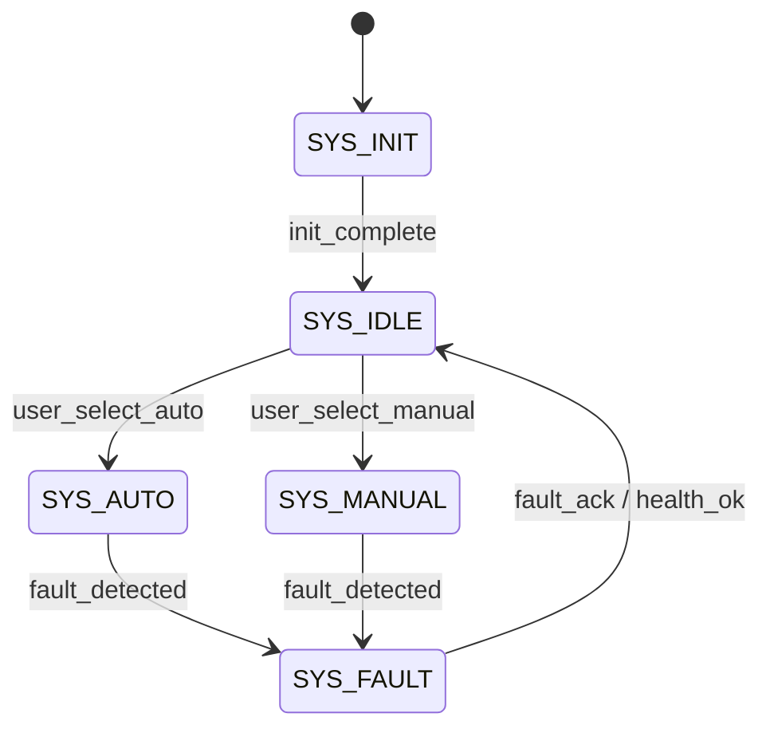

# System Supervisor FSM

!!! warning "Design archive — superseded by the as-built firmware"
    This page was written during the design phase, before implementation. The
    shipped firmware (v2.0.0, `egg_incubator_v2/`) implements control as
    procedural task loops rather than these formal FSM modules, and has no
    water-level hardware. Kept unchanged for design history — see
    *Software → RTOS Architecture* for the as-built design.


Purpose
- Coordinate global operating modes and enforce system-wide safety.

States
- `SYS_INIT` — system initialization and self-tests.
- `SYS_IDLE` — ready state; subsystems inactive or waiting for user.
- `SYS_AUTO` — autonomous control (profiles active).
- `SYS_MANUAL` — manual control; UI or remote commands may drive actuators.
- `SYS_FAULT` — fault present; subsystems disabled and user action required.

Key transitions

| Current | Event | Next | Notes |
|---|---:|---|---|
| `SYS_INIT` | init_complete | `SYS_IDLE` | Post-start validation passed |
| `SYS_IDLE` | user_select_auto | `SYS_AUTO` | Enable control FSMs |
| `SYS_IDLE` | user_select_manual | `SYS_MANUAL` | Allow manual actuator requests |
| Any | fault_detected | `SYS_FAULT` | Fault priority overrides other modes |
| `SYS_FAULT` | fault_ack && health_ok | `SYS_IDLE` | Requires explicit user ACK |

Behavior and responsibilities
- Validate platform health at startup (NVS, RTC, critical sensors).
- Gate enable/disable signals for subsystem FSMs.
- Aggregate health and forward `FAULT` events to Alarm FSM.
- Record mode changes and persist selected profile where appropriate.

Implementation notes
- Expose `supervisor_set_mode()` API for UI and remote commands.
- Use event flags to enable/disable control FSM processing rather than
  deleting tasks.
- Log transitions for post-mortem analysis.

Test cases
- Simulate a sensor fault during `SYS_AUTO` and verify that the system
  transitions to `SYS_FAULT`, disables heaters, and emits an alarm event.
- Verify `SYS_FAULT` persists across short reboots until acknowledged.

State diagram



Implementation snippet

```c
typedef enum { SYS_INIT, SYS_IDLE, SYS_AUTO, SYS_MANUAL, SYS_FAULT } sys_mode_t;
static sys_mode_t g_mode = SYS_INIT;

void supervisor_handle_event(event_t e) {
  switch (g_mode) {
    case SYS_INIT:
      if (e == EV_INIT_COMPLETE) g_mode = SYS_IDLE;
      break;
    case SYS_IDLE:
      if (e == EV_SELECT_AUTO) g_mode = SYS_AUTO;
      if (e == EV_SELECT_MANUAL) g_mode = SYS_MANUAL;
      break;
    default:
      if (e == EV_FAULT_DETECTED) g_mode = SYS_FAULT;
  }
  // persist and log mode changes
}
```
