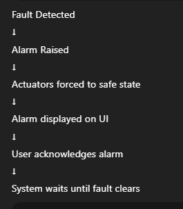

# Alarms

## Introduction

This document describes the **alarm system** used in the  
**Reusable Environmental Control Platform**.

Alarms are a critical part of the system and are designed to:
- Protect hardware and users
- Prevent unsafe operation
- Clearly notify abnormal conditions
- Require explicit user acknowledgment

Alarms always have **higher priority** than normal operation.

---

## Alarm Philosophy

The alarm system follows these core principles:

1. **Safety first**
2. **Deterministic behavior**
3. **Clear visibility to the user**
4. **Explicit acknowledgment**
5. **Safe recovery only after fault removal**

An alarm is not just a message—it is a **system state**.

---

## Alarm Levels

Each alarm is assigned a severity level.

| Level | Description |
|----|----|
| INFO | Informational event, no action required |
| WARNING | Abnormal condition, system may continue with restrictions |
| CRITICAL | Unsafe condition, system enters safe state |

Severity levels may be interpreted differently depending on the active profile.

---

## Alarm Types

The platform supports the following alarm categories:

### Temperature Alarms
- Temperature sensor failure
- Temperature too high
- Temperature too low

### Humidity Alarms
- Humidity sensor failure
- Humidity too high
- Humidity too low

### Water Level Alarms
- Water level low
- Water level sensor failure

### System Alarms
- General system fault
- Configuration error

---

## Alarm Finite State Machine (Alarm FSM)

The alarm system is implemented using a dedicated FSM.

### Alarm FSM States
- `ALARM_CLEAR` – No active alarm
- `ALARM_ACTIVE` – Alarm present and unacknowledged
- `ALARM_ACKED` – Alarm acknowledged, condition still present

---

### Alarm FSM Behavior

| Condition | Action |
|--------|--------|
| Fault detected | Enter `ALARM_ACTIVE` |
| User acknowledges | Enter `ALARM_ACKED` |
| Fault condition cleared | Return to `ALARM_CLEAR` |

---

## Alarm Flow

This ensures unsafe conditions are never ignored.

---

## Interaction With Control Logic

When an alarm is active:
- Normal control FSMs are suspended or restricted
- Actuators are driven to a safe OFF state (for CRITICAL alarms)
- User input is limited to alarm acknowledgment

Alarm logic overrides profile and UI behavior.

---

## Profile-Based Alarm Severity

Alarm severity may vary by profile.

Example:
- High temperature in **Incubator** → CRITICAL
- High temperature in **Thermostat** → WARNING

Profiles define how alarms are interpreted, not how they are detected.

---

## UI Behavior During Alarms

- UI switches to a dedicated alarm screen
- Alarm message is clearly displayed
- Normal navigation is disabled
- Short press acknowledges the alarm

The user cannot bypass an active alarm.

---

## Alarm Logging

Each alarm event is logged with:
- Alarm type
- Severity
- Timestamp
- System state

This provides traceability and aids debugging.

---

## Recovery Rules

The system only recovers from an alarm when:
1. The user has acknowledged the alarm
2. The fault condition is no longer present

Automatic recovery without acknowledgment is not allowed for critical alarms.

---

## Safety Guarantees

The alarm system guarantees that:
- Unsafe actuator states are prevented
- Faults are visible to the user
- Recovery is controlled and explicit
- System behavior remains deterministic

---

## Summary

The alarm system:
- Protects hardware and users
- Enforces safe system behavior
- Integrates tightly with FSMs and UI
- Supports profile-based severity handling

It is a fundamental component of the platform’s safety architecture.

---

➡️ Next: **Safety & Logging → Logging**
