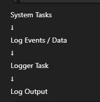

# Logging

## Introduction

This document describes the **logging system** used in the  
**Reusable Environmental Control Platform**.

Logging provides **visibility, traceability, and diagnosability** of system behavior over time.  
Unlike alarms, logging does not directly affect system operation.

---

## Purpose of Logging

The logging system is designed to:
- Record system behavior over time
- Capture important events and state changes
- Aid debugging and fault analysis
- Support future data analysis and optimization

Logging is treated as **observational**, not control-critical.

---

## Logging Types

The platform implements two main types of logging:

### Periodic Logging
- Records system state at fixed intervals
- Used for trend analysis and monitoring

### Event-Based Logging
- Records important system events immediately
- Used for diagnostics and traceability

---

## Logged Parameters

### Periodic Log Data

Periodic logs may include:
- Timestamp
- Temperature
- Humidity (if enabled)
- Water level (if enabled)
- Active profile
- System state
- Control mode (AUTO / MANUAL)

These logs provide a snapshot of system health over time.

---

### Event Log Data

Event logs are generated for:
- System startup and reset
- Profile changes
- Mode changes
- Alarm raised
- Alarm acknowledged
- Alarm cleared
- Sensor failure and recovery

Event logs are timestamped and ordered.

---

## Logging Frequency

Typical logging intervals:

| Log Type | Interval |
|------|---------|
| Periodic system log | 30–60 seconds |
| Event logs | Immediate |

Logging frequency may be adjusted per profile.

---

## Logging Architecture

The logging system is implemented as a **dedicated Logger Task**.

The logger task operates independently and never blocks control logic.

---

## Log Storage and Output

### Initial Implementation
- Serial output (UART)
- Human-readable text format

### Future Extensions
- SD card storage
- Flash-based circular buffer
- Cloud logging via Wi-Fi
- MQTT or REST integration

The logging interface is designed to support multiple backends.

---

## Log Data Structure

Each log entry includes:
- Timestamp
- Log type (periodic or event)
- Log message or structured data
- Severity level (if applicable)

Structured logging is preferred over free-form text.

---

## RTOS Integration

Logging follows RTOS best practices:
- Logger runs at low priority
- Logging is non-blocking
- Data passed via queues
- No dynamic memory allocation in logging paths

This ensures system stability.

---

## Interaction With Alarms

Alarm-related events are always logged:
- Alarm raised
- Alarm acknowledged
- Alarm cleared

This provides a full history of fault conditions.

---

## Performance and Safety Considerations

- Logging never delays control decisions
- Logs are dropped if buffers are full
- Logging failures do not affect system operation

Safety-critical behavior never depends on logging.

---

## Log Review and Analysis

Logs can be used to:
- Diagnose unexpected behavior
- Verify system stability
- Analyze environmental trends
- Improve control parameters

Log data is a valuable tool for both development and field use.

---

## Summary

The logging system:
- Provides system visibility and traceability
- Operates independently of control logic
- Supports future expansion
- Aligns with RTOS and safety requirements

Logging completes the platform’s observability and diagnostic capabilities.

---

➡️ Next: **Development → Development Flow**
