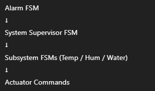

# FSM Design

## Introduction

This document describes the **Finite State Machine (FSM) architecture** used in the  
**Reusable Environmental Control Platform**.

FSMs are the core mechanism used to ensure:
- Predictable system behavior
- Safe transitions between operating modes
- Clear and testable control logic

All critical decisions in the system are handled through FSMs.

---

## Why FSMs?

FSMs are used instead of conditional-heavy logic because they:
- Make system behavior explicit
- Prevent undefined or illegal states
- Simplify safety handling
- Improve readability and maintainability
- Make testing and debugging easier

Every FSM in the platform has:
- A defined set of states
- Explicit transitions
- Clear entry and exit conditions

---

## FSM Hierarchy

The platform uses **multiple coordinated FSMs**, not a single monolithic FSM.

System Supervisor FSM
├── Temperature Control FSM
├── Humidity Control FSM
├── Water Level FSM
└── Alarm FSM

Each FSM has a specific responsibility and scope.

---

## System Supervisor FSM

### Purpose
The System Supervisor FSM controls the **overall operating mode** of the platform.

### States
- `SYS_INIT`
- `SYS_IDLE`
- `SYS_AUTO`
- `SYS_MANUAL`
- `SYS_FAULT`

### Behavior
- Initializes the system
- Enables or disables subsystem FSMs
- Enforces safe behavior during faults

### State Transitions

| Current State | Condition | Next State |
|--------------|-----------|------------|
| SYS_INIT | Initialization complete | SYS_IDLE |
| SYS_IDLE | AUTO selected | SYS_AUTO |
| SYS_IDLE | MANUAL selected | SYS_MANUAL |
| Any | Fault detected | SYS_FAULT |
| SYS_FAULT | Fault cleared & ACK | SYS_IDLE |

---

## Temperature Control FSM

### Purpose
Controls heating and cooling based on temperature feedback.

### States
- `TEMP_IDLE`
- `TEMP_HEATING`
- `TEMP_COOLING`
- `TEMP_FAULT`

### Control Logic
- ON–OFF control with hysteresis
- Heater and cooler are mutually exclusive

### State Transitions

| Condition | State |
|---------|------|
| Temp < Setpoint − Hysteresis | TEMP_HEATING |
| Temp > Setpoint + Hysteresis | TEMP_COOLING |
| Within band | TEMP_IDLE |
| Sensor failure | TEMP_FAULT |

---

## Humidity Control FSM

### Purpose
Maintains target humidity levels for applicable profiles.

### States
- `HUM_IDLE`
- `HUM_HUMIDIFY`
- `HUM_DEHUMIDIFY`
- `HUM_FAULT`

### State Transitions

| Condition | State |
|---------|------|
| Hum < Target − Hysteresis | HUM_HUMIDIFY |
| Hum > Target + Hysteresis | HUM_DEHUMIDIFY |
| Within band | HUM_IDLE |
| Sensor failure | HUM_FAULT |

---

## Water Level FSM

### Purpose
Ensures sufficient water availability for humidification or cooling.

### States
- `WATER_OK`
- `WATER_LOW`
- `WATER_FILLING`
- `WATER_FAULT`

### Behavior
- Monitors water level
- Activates pump if required
- Raises alarms on low or invalid readings

---

## Alarm FSM

### Purpose
Manages all alarm conditions and system-wide safety responses.

### States
- `ALARM_CLEAR`
- `ALARM_ACTIVE`
- `ALARM_ACKED`

### Behavior
- Overrides normal operation
- Forces actuators to safe state
- Requires user acknowledgment

---

## FSM Interaction Rules

The following priority order is enforced:

Higher-level FSMs always override lower-level FSMs.

---

## FSM and Profiles

Profiles control **which FSMs are active**.

| Profile | Temp FSM | Hum FSM | Water FSM |
|------|---------|--------|----------|
| Thermostat | ✔ | ✖ | ✖ |
| Incubator | ✔ | ✔ | ✔ |
| Cooler | ✔ | ✖ | ✔ |

FSM logic itself does not change across profiles.

---

## FSM Execution Context

- All FSM logic executes inside the **Control Task**
- FSMs operate on validated sensor data
- FSM outputs are translated into actuator commands
- No FSM directly controls hardware

---

## Safety and Fault Handling

FSMs enforce the following safety rules:
- Invalid sensor data forces FAULT states
- Actuators are disabled during FAULT
- Recovery requires user acknowledgment
- No automatic restart after critical faults

---

## Testing Strategy for FSMs

FSMs can be tested by:
- Injecting simulated sensor values
- Forcing fault conditions
- Verifying state transitions
- Confirming correct actuator commands

This enables unit testing without hardware.

---

## Summary

The FSM-based design:
- Provides deterministic and safe behavior
- Keeps control logic clean and testable
- Supports profile-based reuse
- Scales cleanly as features grow

FSMs are the backbone of reliable operation in this platform.

---

➡️ Next: **Software → Profiles**
