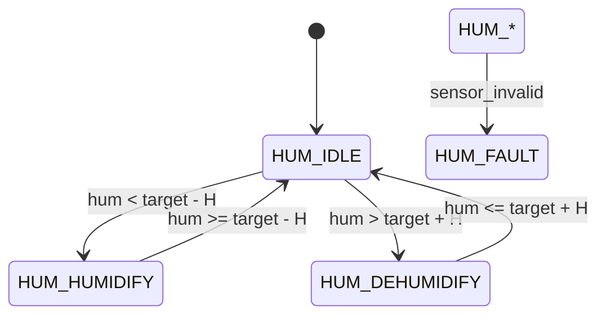

# Humidity Control FSM

Purpose
- Maintain target relative humidity where the selected profile requires it.

States
- `HUM_IDLE` — humidity within acceptable band.
- `HUM_HUMIDIFY` — enable humidifier or misting.
- `HUM_DEHUMIDIFY` — enable dehumidifier or ventilation.
- `HUM_FAULT` — sensor or actuator error.

Transition table

| Condition | Next State | Notes |
|---|---|---|
| sensor_invalid | `HUM_FAULT` | Fault handling immediate |
| hum < target - hysteresis | `HUM_HUMIDIFY` | Start humidifier; enforce pump duty |
| hum > target + hysteresis | `HUM_DEHUMIDIFY` | Start dehumidification / ventilation |
| within band | `HUM_IDLE` | Stop active humidifier / dehumidifier |

Actuation & safety
- Prefer conservative humidifier duty cycles and water-level checks.
- Coordinate with Water Level FSM to avoid running pumps when reservoir is
  low.

Example pseudo-code

```c
void hum_step(float RH) {
  if (!hum_sensor_ok) { fsm_set(HUM_FAULT); return; }
  if (RH < target - H) fsm_set(HUM_HUMIDIFY);
  else if (RH > target + H) fsm_set(HUM_DEHUMIDIFY);
  else fsm_set(HUM_IDLE);
}
```

Testing
- Inject humidity traces to validate cycle behavior and ensure the Water
  FSM prevents humidifier activation during `WATER_LOW`.

State diagram



Implementation snippet

```c
typedef enum { HUM_IDLE, HUM_HUMIDIFY, HUM_DEHUMIDIFY, HUM_FAULT } hum_state_t;
static hum_state_t hum_state = HUM_IDLE;

void hum_step(float RH) {
  if (!hum_sensor_ok()) { hum_state = HUM_FAULT; return; }
  if (RH < target - H) hum_state = HUM_HUMIDIFY;
  else if (RH > target + H) hum_state = HUM_DEHUMIDIFY;
  else hum_state = HUM_IDLE;
  // coordinate with water FSM before issuing humidifier command
}
```
