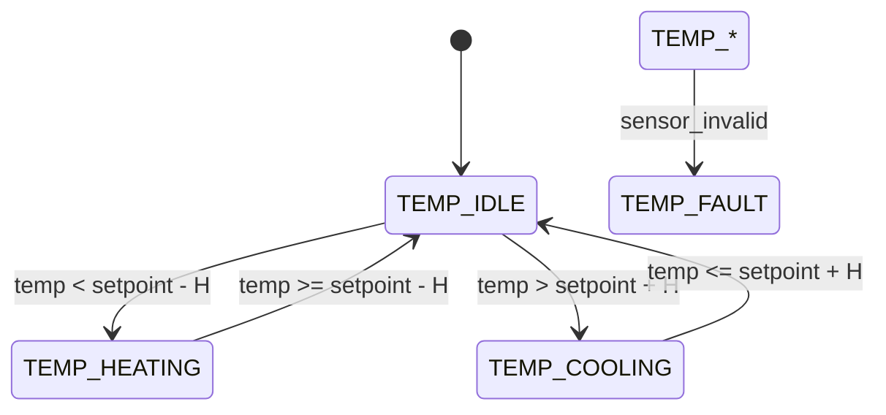

# Temperature Control FSM

Purpose
- Maintain target temperature with hysteresis and safe actuation.

States
- `TEMP_IDLE` — within deadband; no heating or active cooling required.
- `TEMP_HEATING` — request heater ON.
- `TEMP_COOLING` — request active cooling / fan ON.
- `TEMP_FAULT` — sensor or actuator failure detected.

Transition table

| Condition | Next State | Notes |
|---|---|---|
| sensor_invalid | `TEMP_FAULT` | Immediate fault transition |
| temp < setpoint - hysteresis | `TEMP_HEATING` | Start heating; enforce min-on time |
| temp > setpoint + hysteresis | `TEMP_COOLING` | Start cooling; enforce min-on time |
| setpoint - hysteresis <= temp <= setpoint + hysteresis | `TEMP_IDLE` | Stop active outputs |

Actuation model
- Emit high-level commands (e.g., `cmd_heater(on)`, `cmd_fan(speed)`) to the
  Actuator Task. The Actuator Task must serialize access and avoid conflicting
  writes.

Example pseudo-code

```c
void temp_step(float T) {
  if (!sensor_ok) { fsm_set(TEMP_FAULT); return; }
  if (T < setpoint - H) fsm_set(TEMP_HEATING);
  else if (T > setpoint + H) fsm_set(TEMP_COOLING);
  else fsm_set(TEMP_IDLE);
  // On state change emit command: request_heater(state==TEMP_HEATING);
}
```

Timing and hysteresis
- Recommend default hysteresis: 0.5–1.0°C depending on thermal mass.
- Enforce minimum on/off durations (e.g., 30s) to protect relays and reduce
  cycling.

Diagnostics & testing
- Log state changes with timestamps to verify control stability.
- Unit test by injecting temperature traces that cross thresholds and
  assert expected state sequence and actuator commands.

State diagram



Implementation snippet

```c
typedef enum { TEMP_IDLE, TEMP_HEATING, TEMP_COOLING, TEMP_FAULT } temp_state_t;
static temp_state_t temp_state = TEMP_IDLE;

void temp_step(float T) {
  if (!sensor_ok()) { temp_state = TEMP_FAULT; return; }
  if (T < setpoint - H) temp_state = TEMP_HEATING;
  else if (T > setpoint + H) temp_state = TEMP_COOLING;
  else temp_state = TEMP_IDLE;
  // emit command: actuator_request_heater(temp_state==TEMP_HEATING);
}
```
