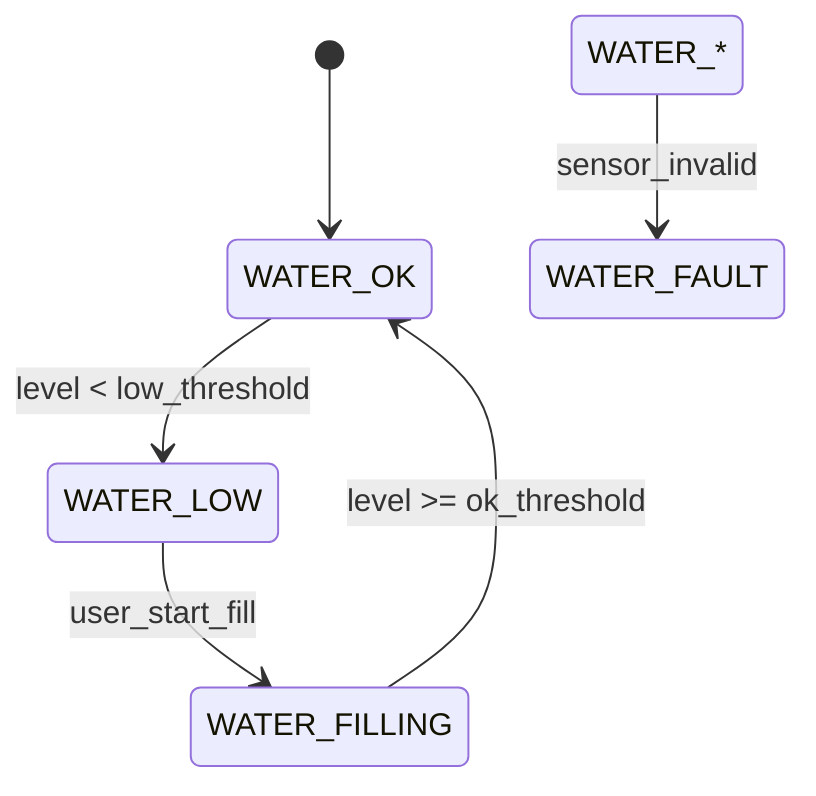

# Water Level FSM

Purpose
- Ensure safe reservoir management for humidification and cooling systems.

States
- `WATER_OK` — reservoir level sufficient.
- `WATER_LOW` — level below threshold; do not permit humidifier operation.
- `WATER_FILLING` — active fill operation in progress.
- `WATER_FAULT` — sensor or valve/pump failure.

Transition table

| Condition | Next State | Notes |
|---|---|---|
| level_sensor_invalid | `WATER_FAULT` | Immediate safety stop |
| level < low_threshold | `WATER_LOW` | Raise alarm; block humidifier |
| user_start_fill | `WATER_FILLING` | Open valve / run pump with timeout |
| level >= ok_threshold | `WATER_OK` | Resume normal ops |

Behavior
- Block humidifier requests when `WATER_LOW` or `WATER_FAULT`.
- Use a fill timeout and validate above-threshold reading after filling.
- Emit alarms when repeated fills fail or sensors fluctuate.

Example pseudo-code

```c
void water_step(int level) {
  if (!level_sensor_ok) { fsm_set(WATER_FAULT); return; }
  if (level < LOW) fsm_set(WATER_LOW);
  else if (filling_active) fsm_set(WATER_FILLING);
  else fsm_set(WATER_OK);
}
```

Testing
- Simulate reservoir drains and ensure humidifier is blocked and alarms are
  raised. Validate fill sequence resumes normal operation.

State diagram



Implementation snippet

```c
typedef enum { WATER_OK, WATER_LOW, WATER_FILLING, WATER_FAULT } water_state_t;
static water_state_t water_state = WATER_OK;

void water_step(int level) {
  if (!level_sensor_ok()) { water_state = WATER_FAULT; return; }
  if (level < LOW) water_state = WATER_LOW;
  else if (filling_active()) water_state = WATER_FILLING;
  else water_state = WATER_OK;
  // block humidifier when water_state!=WATER_OK
}
```
