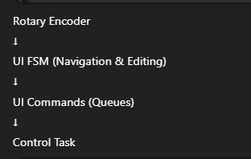
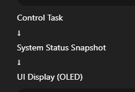

# UI Overview

## Introduction

This document describes the **User Interface (UI) architecture** of the  
**Reusable Environmental Control Platform**.

The UI is designed to be:
- Simple
- Reliable
- Deterministic
- Profile-aware
- Suitable for long-term use

The UI follows a **classic Nokia-style design philosophy**, prioritizing clarity and robustness over visual complexity.

---

## UI Design Goals

The primary goals of the UI design are:

- Provide clear visibility of system status
- Allow safe configuration of system parameters
- Never interfere with control logic
- Remain responsive under all conditions
- Work consistently across all profiles

The UI is not responsible for making control decisions.

---

## UI Hardware Components

The UI subsystem consists of:
- **OLED Display** (I²C)
- **Rotary Encoder with Push Button**

These components provide a minimal yet powerful interaction model suitable for embedded systems.

---

## UI Architecture Overview

System status flows in the opposite direction:

The UI never accesses sensors or actuators directly.

---

## UI Finite State Machine (UI FSM)

The UI behavior is controlled using a dedicated FSM.

### UI FSM States
- `UI_BOOT` – Startup screen
- `UI_HOME` – Status display
- `UI_MENU_LIST` – Menu navigation
- `UI_VALUE_EDIT` – Parameter editing
- `UI_ALARM` – Alarm display and acknowledgment

Each state has a clear purpose and defined transitions.

---

## Status Display (Home Screen)

The home screen provides real-time visibility of:
- Temperature
- Humidity (if enabled)
- Water level (if enabled)
- System mode (AUTO / MANUAL)
- Active profile
- System state (IDLE / HEATING / COOLING / FAULT)

The home screen is **read-only**.

---

## Menu-Based Navigation

All configuration is performed using a **menu-driven interface**.

Menu characteristics:
- Vertical list layout
- Single active selection
- Profile-dependent menu items
- Consistent navigation rules

The menu structure adapts automatically based on the active profile.

---

## Parameter Editing

When editing a value:
- Only one parameter is edited at a time
- Changes are previewed before confirmation
- Limits are enforced by the control logic
- Canceling an edit restores the previous value

This prevents accidental or unsafe configuration changes.

---

## Alarm UI Behavior

When an alarm is active:
- The UI enters a dedicated alarm screen
- Normal navigation is blocked
- Alarm message is displayed clearly
- User acknowledgment is required

Alarms always override normal UI behavior.

---

## Profile Awareness

The UI dynamically adapts based on the active profile:
- Displays only relevant parameters
- Shows only applicable menu items
- Hides unused sensors and actuators

This keeps the UI clean and context-aware.

---

## UI Safety Rules

The following safety rules are enforced:
- UI cannot directly control actuators
- UI input is ignored during critical faults
- Unsafe values cannot be committed
- All changes go through control validation

---

## Performance Considerations

- OLED refresh rate is limited to avoid flicker
- Encoder input is debounced
- UI task runs at lower priority than control logic
- No blocking delays are used in UI code

This ensures a responsive and stable system.

---

## Summary

The UI subsystem:
- Provides reliable local interaction
- Is fully decoupled from control logic
- Adapts automatically to different profiles
- Prioritizes safety and clarity

The Nokia-style UI ensures consistent and predictable behavior across all use cases.

---

➡️ Next: **User Interface → Nokia Style UI**
