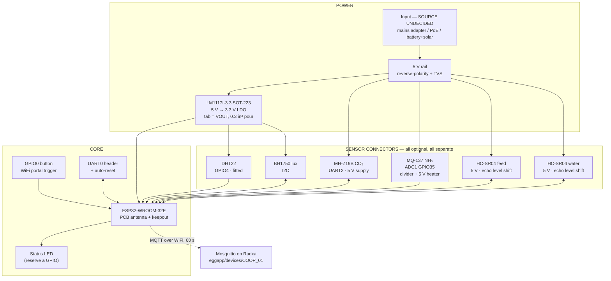

# Coop monitor — block diagram

## Blocks

**Power input.** Source undecided and blocking —
[../README.md](../README.md#blocking-decisions). Whatever it is, the input
needs reverse-polarity protection and a TVS: this board is wired up in a shed,
by hand, possibly in the dark.

**Two rails.** 3.3 V for the ESP32, DHT22 and BH1750; 5 V for the MH-Z19B, the
MQ-137 heater and both HC-SR04s. The 5 V loads are the majority, which is why
the power decision cannot be deferred.

**ESP32-WROOM-32E.** PCB antenna, matching the incubator board. The keepout is
mandatory: no copper on any layer beneath it, module overhanging the board edge
([CONVENTIONS.md](../../CONVENTIONS.md#antenna-keepout)).

**This is the board where that choice carries risk.** The AP is typically in
the house and the node is in an outbuilding, possibly through a wall or two. A
PCB antenna has meaningfully less range than an external one, and the failure
mode is not a dead node — it is a node that associates, drops, and reconnects
all day, publishing intermittently. Range-test a module at the actual mounting
point before committing to layout. If it is marginal, the -32UE is a
same-family swap that is cheap now and a respin later.

**GPIO0 button.** The only field-accessible control on the device. See
[pin-map.md](pin-map.md#gpio0--the-provisioning-button).

**Status LED.** Not in the firmware yet, but reserve the GPIO and the footprint.
A sensor-only node with no display, no buttons and no screen gives the user
nothing to look at when it stops publishing.

**Sensor connectors.** One per sensor, each independently fittable. The
firmware compiles out absent channels and omits the field from the payload
entirely, so the consumer shows "no sensor" rather than a fault — the board
should support the same incremental build-up. A node with only a DHT22 fitted
is a valid, shippable configuration.

**Level shifting.** Both HC-SR04 echo lines. Mandatory, not optional; GPIO34
has no clamp. See [pin-map.md](pin-map.md#hc-sr04-level-shifting).

**MQ-137 divider.** Sized to keep the useful range in the ADC's linear middle.
This divider is part of the sensor's calibration — changing it invalidates
every prior reading.

## What this board deliberately does not have

No relays, no mains switching, no control outputs, no display. Per
[ADR 0009](../../../docs/architecture/adr/0009-coop-monitoring-devices.md) the
coop node cannot energise anything. If a future requirement wants a coop-side
actuator — a fan, a light, an auto-door — that is a new board and a new ADR,
not a populate option on this one.

## Open questions

- Power source (blocking everything else).
- Whether the sensors mount on the board or on flying leads. Ammonia and dust
  argue for a sealed box with remote sensor heads; cost and connector count
  argue the other way. This decides the connector strategy.
- Ingress rating and how the sensors see coop air without the electronics
  seeing it too.
