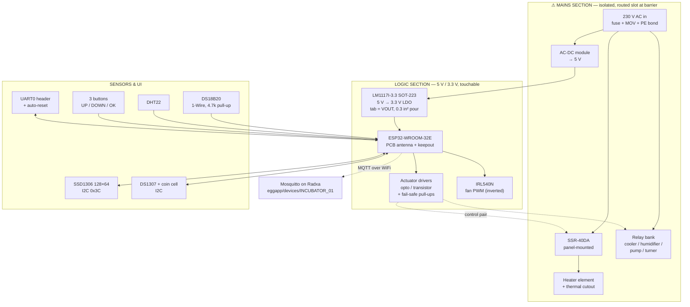

# Incubator — block diagram

## Blocks

**Mains input.** Line fuse first, then MOV, then the AC-DC module. PE bonded to
chassis with a ring terminal, not a trace.

**AC-DC module.** Encapsulated 5 V module rather than a discrete supply. It
keeps the switching design, its certification and its clearances off this board.

**3.3 V rail.** From 5 V. The ESP32's transmit bursts are the sizing case —
see [power-budget.md](power-budget.md).

**ESP32-WROOM-32E.** PCB antenna, per the schematic. The keepout is therefore a
hard placement constraint: no copper on any layer under the antenna, and the
module overhanging the board edge
([CONVENTIONS.md](../../CONVENTIONS.md#antenna-keepout)).

This choice interacts with the enclosure. A metal-lined incubator cabinet
attenuates 2.4 GHz badly, and a PCB antenna has no escape from it. Mounting the
controller **outside** the heated volume — which the thermal analysis already
recommends for the module's 85 °C rating and the electrolytics — is what makes
the PCB antenna workable here. If the board ends up inside a metal cabinet
after all, revisit the module choice before layout, not after.

**Actuator drivers.** Opto-isolated or transistor-buffered, active-LOW to match
`RELAY_ON == LOW`, each with a pull-up to 3.3 V so the load is OFF while the
ESP32 is in reset. See
[../README.md](../README.md#safety).

**Heater path.** SSR-40DA is a panel-mounted module — only its low-current
control pair reaches the PCB, keeping the 40 A path off the board entirely. A
**thermal cutout in series with the heater element**, independent of the
ESP32, is what makes the over-temperature limit real: an SSR fails short more
often than open, and a firmware watchdog cannot open a shorted triac.

**Fan.** Not a relay despite the `RELAY_FAN` macro name. LEDC PWM through an
IRL540N logic-level MOSFET, inverted duty — 100 % speed drives the pin LOW.
Flyback diode across the fan.

**Sensors.** DS18B20 is primary temperature; DHT22 provides humidity and a
cross-check. Firmware alarms if they disagree by more than 5 °C for 5 minutes
([config.h:177-178](../../../apps/firmware/egg_incubator_v2/config.h#L177-L178)),
so the two must be mounted where they see the same air — defeating the check by
putting one in the airstream and the other against the wall produces a
permanent nuisance alarm.

**RTC.** DS1307 with a coin cell, sharing the I2C bus with the OLED. Firmware
also syncs NTP, so the RTC covers the offline case only.

**UI.** 128×64 OLED and three active-LOW buttons.

## Open questions

- Switching element for cooler / humidifier / pump / turner (see
  [../README.md](../README.md#blocking-decisions)).
- Which loads are mains and which are low-voltage DC.
- Whether the 5 V rail also feeds an external load, which changes the AC-DC
  module's rating.
